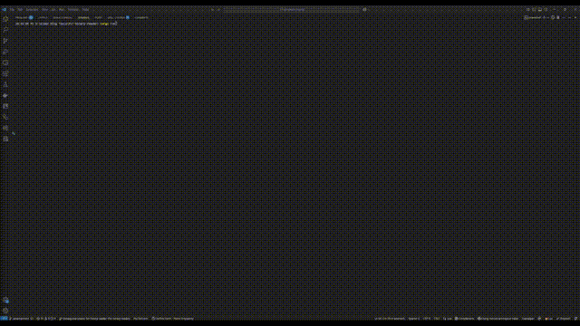
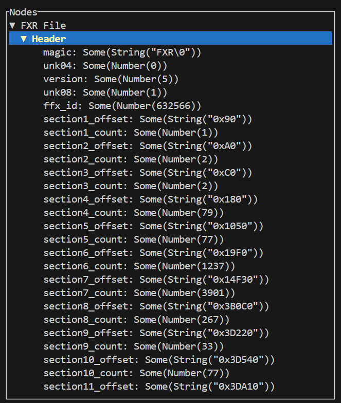

# FXR Binary Reader



The **FXR Binary Reader** is a Rust-based tool designed to parse and visualize `.fxr` binary files. It provides a terminal-based user interface to explore the structure and contents of FXR files, including their headers and sections.

## Features

- Parses `.fxr` binary files and extracts structured data.
- Displays file sections and their hierarchical relationships in a tree view.
- Supports navigation and selection of files in the terminal.
- Logs errors and crashes for debugging purposes.

## Usage

1. Download the [latest release](https://github.com/chozandrias76/fxr-binary-reader/releases).
1. Run the exe
1. Use arrow keys, enter keys, q, and escape for navigation
1. Here's an of an open FXR:



## Development

### Requirements

- **Rust**: Ensure you have Rust installed. You can install it using [rustup](https://rustup.rs/).
- **Cargo**: Comes with Rust and is used for building and running the project.

### Installation

1. Clone the repository:
   ```sh
   git clone https://github.com/chozandrias76/fxr-binary-reader.git
   cd fxr-binary-reader
   ```
1. Run the project
   `cargo run`